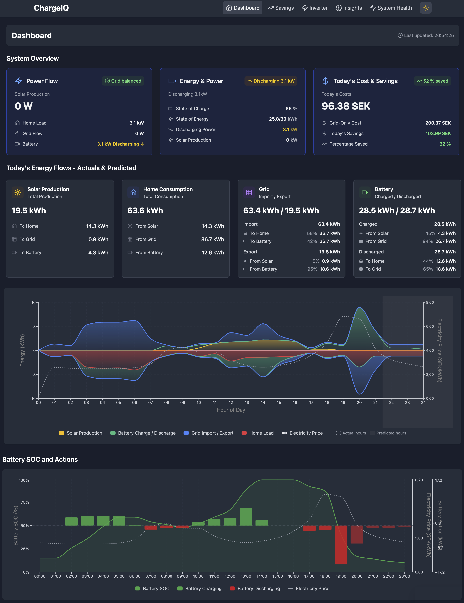
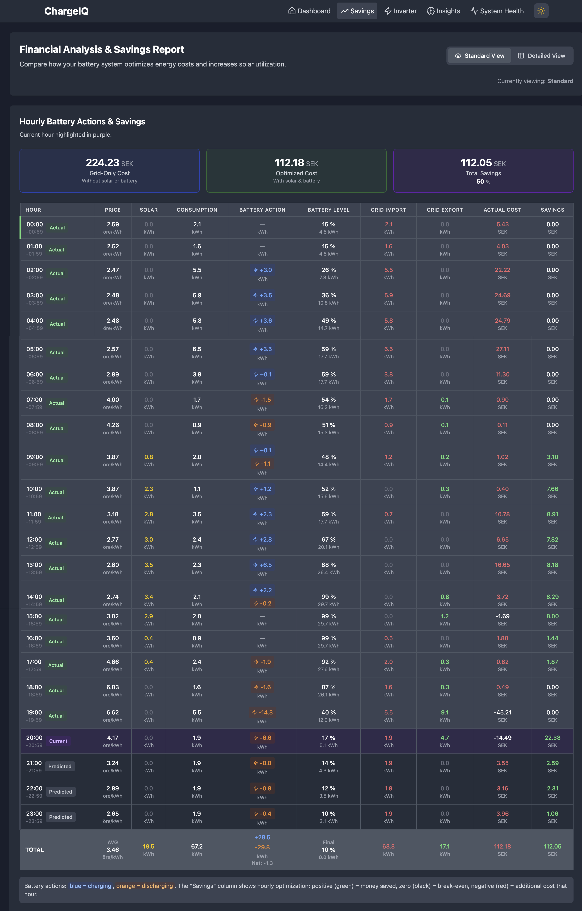

# BESS Battery Manager Add-on for Home Assistant

Intelligent Battery Energy Storage System (BESS) management and optimization for Home Assistant.

> **💰 Maximize your battery savings** by automatically optimizing your battery storage system with real-time price data, solar integration, and adaptive scheduling.

## Overview

The BESS Battery Manager is a sophisticated Home Assistant add-on that automatically optimizes Growatt inverter battery storage systems using dynamic programming algorithms and Nordic electricity market pricing. It continuously analyzes published electricity prices, solar production forecasts, and consumption predictions to determine optimal charge/discharge schedules that minimize your electricity costs.

The system requires the Growatt, Nordpool, and solar forecast (e.g., Solcast) Home Assistant integrations to function, and optionally uses InfluxDB for historical data storage. Unlike simple timer-based systems, BESS Manager makes intelligent decisions by weighing multiple factors: current battery state, published hourly electricity prices, solar weather forecasts, consumption estimates, and battery degradation costs. The system updates its optimization strategy every hour as new sensor data becomes available, ensuring your battery always operates in the most economically beneficial way while respecting technical constraints like charge rates and depth-of-discharge limits.

## Key Capabilities

**Dynamic Programming Optimization**: Solves 24-hour energy scheduling as an optimization problem, considering electricity prices, solar forecasts, consumption patterns, and battery constraints to find the globally optimal charge/discharge schedule.

**Nordpool Market Integration**: Automatically retrieves hourly electricity prices from Nordic power markets and updates optimization decisions when tomorrow's prices become available (typically around 13:00).

**Battery Wear Economics**: Incorporates battery degradation costs (cycle wear, depth-of-discharge impacts) into optimization calculations to balance immediate savings against long-term battery life.

**Hourly Re-optimization**: Recalculates the optimal 24-hour schedule every hour as predicted values become actual.

**Comprehensive Energy Tracking**: Tracks all energy flows (solar production, grid import/export, battery charge/discharge, home consumption) with detailed cost analysis and savings calculations.

**Power Monitoring & Fuse Protection**: Monitors grid current to prevent overloading electrical fuses by limiting battery charging when household consumption is high.

### Web Interface

The BESS Manager provides a comprehensive web interface organized into focused pages:

**Dashboard**: Real-time system overview with live energy flows, current battery optimization decisions, and today's performance summary.

**Savings**: Financial analysis with daily savings breakdown, cost comparisons between grid-only vs solar-only vs optimized battery scenarios, and detailed hourly cost analysis.

**Inverter**: Detailed information about your inverter including current status, active schedule, operating modes, and configuration settings.

**Insights**: Understand the economic reasoning behind every battery decision - why the system chose to charge, discharge, or remain idle at any given time.

**System Health**: Component status monitoring with sensor validation, integration health checks, and system diagnostics.

## Compatibility

### Supported Battery Systems

- ✅ **Growatt inverters** with controllable battery storage via Home Assistant
- ⚠️ **Compatibility**: Your Growatt integration must provide both read access (energy sensors) and write access (battery control entities)
- 📋 **Check compatibility**: Review required sensors in configuration documentation before installation. Tested with MIN/TLX inverters

### Required Integrations

- 📊 **Nordpool** integration for electricity prices
- 🏠 **Growatt** integration for battery control and energy monitoring
- ☀️ **Solar forecast** integration (e.g., Solcast) for production predictions
- 📈 **InfluxDB** (optional but recommended for historical data)
- ⚡ **Tibber** integration (optional for power monitoring and fuse protection)

## Screenshots


*Beautiful energy flow visualization with real-time optimization results*

  
*Detailed savings breakdown with battery actions and ROi calculations*


*Intelligent scheduling showing charge/discharge decisions with price predictions*

> 📸 **Screenshot placeholders** - Add actual screenshots to `docs/images/` directory

## Quick Start

1. Add our repository to your Home Assistant add-on store:

   ```text
   https://github.com/johanzander/bess-manager
   ```

2. Install the "BESS Manager" add-on from the add-on store

3. Configure the basic settings:

   ```yaml
   battery:
     total_capacity: 30.0    # Battery total capacity in kWh
     min_soc: 10.0          # Minimum state of charge (%)
   price:
     area: "SE4"            # Your Nordpool price area
   ```

4. Start the add-on and enjoy automatic optimization! 🎉

For detailed setup instructions, see [DEPLOYMENT.md](DEPLOYMENT.md).

## How It Works

**The optimization process:**

- 📊 **Analyzes prices** - Monitors Nordpool electricity prices continuously
- 🧠 **Calculates optimal strategy** - Uses dynamic programming to find best charge/discharge schedule
- ⚡ **Executes decisions** - Automatically adjusts your Growatt inverter settings
- 📈 **Tracks results** - Measures actual savings and system performance

*Savings depend on your local electricity prices, consumption patterns, battery size, and price volatility.*

## Documentation

- 📚 **[User Guide](USER_GUIDE.md)** - Understanding the interface and results
- 🔧 **[Deployment Guide](DEPLOYMENT.md)** - Complete installation and production setup
- 🏗️ **[Software Architecture](SOFTWARE_DESIGN.md)** - Technical design and system architecture
- 👨‍💻 **[Development Guide](DEVELOPMENT.md)** - Contributing and development setup

## Community & Support

- 🐛 **Issues**: [GitHub Issues](https://github.com/johanzander/bess-manager/issues)
- 💬 **Community**: [Home Assistant Community Forum](https://community.home-assistant.io/)
- 📢 **Updates**: Follow repository for latest features
- ⭐ **Like it?** Star the repository to support development!

## License

This project is licensed under the MIT License - see the LICENSE file for details.
