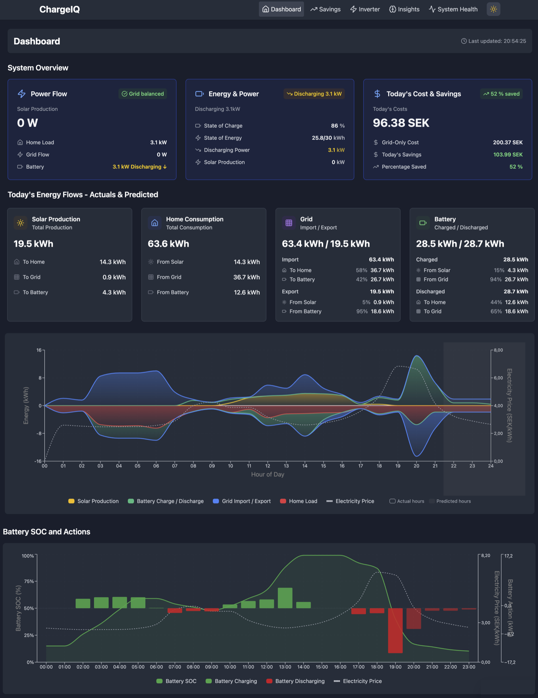
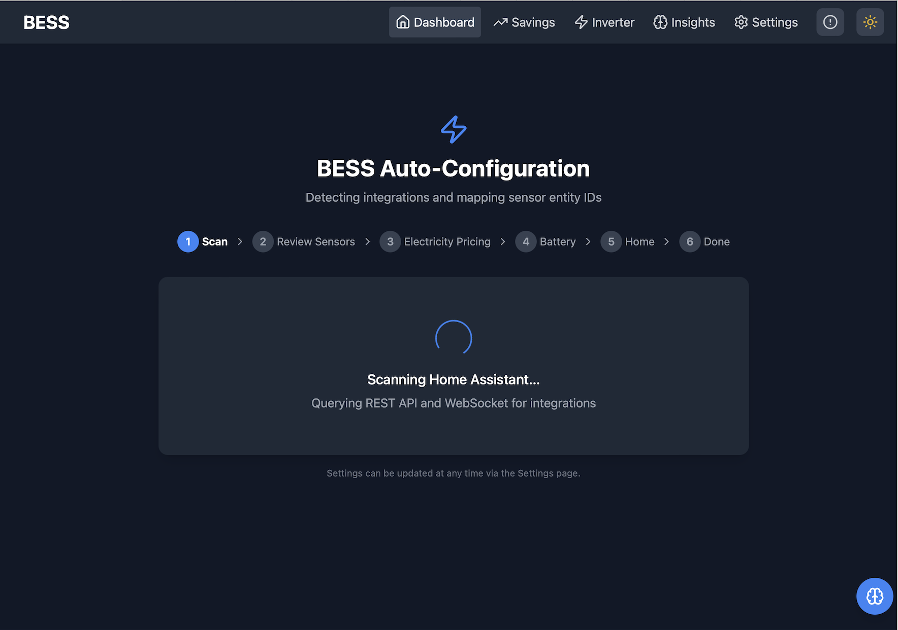
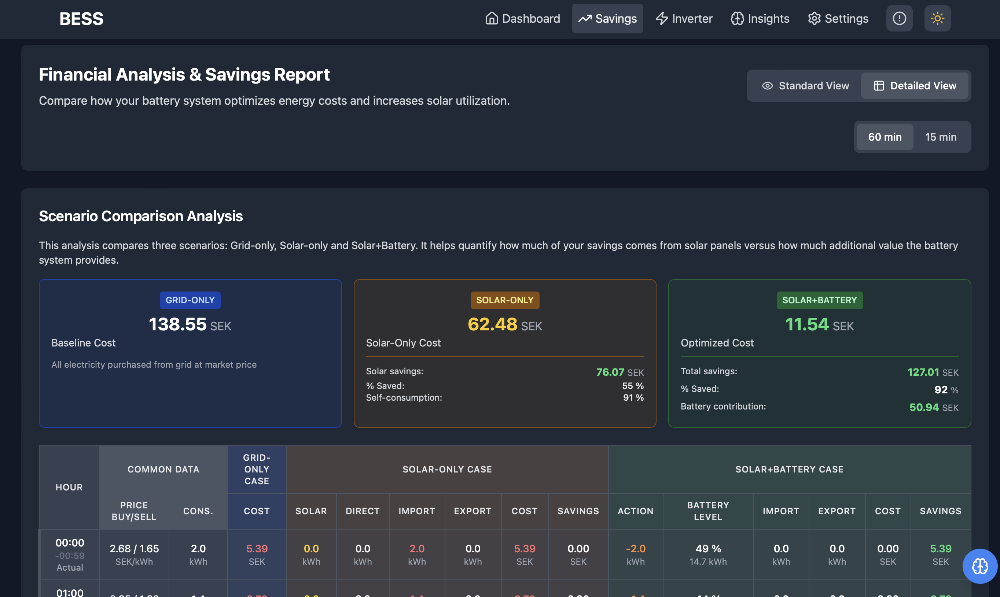
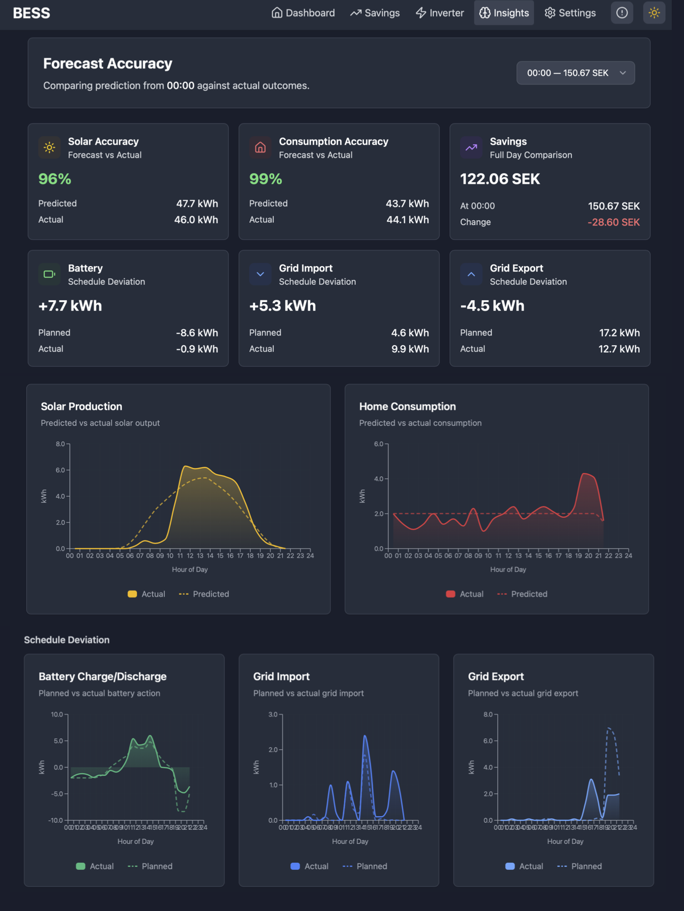
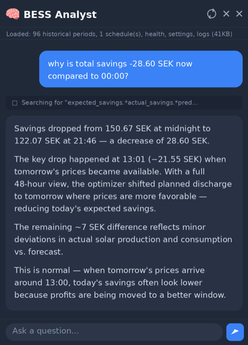

# ChargeIQ — Smart Battery Optimization for Home Assistant

**Install it, forget it, and slash your energy bills.** ChargeIQ continuously optimizes your battery against live electricity prices, solar forecasts, and your household patterns.

---

<table><tr>
<td width="50%" valign="top">

### Setup in Minutes, Not Hours

No YAML files. No manual entering of entity IDs. The setup wizard auto-discovers your inverter, price source, and solar forecast from Home Assistant — just confirm and go.

</td>
<td width="50%">

</td>
</tr></table>

<table><tr>
<td width="50%">

</td>
<td width="50%" valign="top">

### See Exactly Where Your Money Goes

ChargeIQ tracks every kWh and every cent. Compare three scenarios side by side — what you'd pay with **grid only**, with **solar only**, and with **solar + optimized battery** — so you can see exactly how much value the battery adds.

</td>
</tr></table>

<table><tr>
<td width="50%" valign="top">

### Predictions You Can Trust

See how accurate the forecasts are — solar, consumption, and savings — with predicted-vs-actual comparisons so you know it's working, not guessing.

</td>
<td width="50%">

</td>
</tr></table>

<table><tr>
<td width="50%">

</td>
<td width="50%" valign="top">

### Ask Your Battery Why

Something look off? The built-in AI Analyst explains every decision in plain language. Ask "why did the battery charge at 3am?" or "why are today's savings lower than yesterday?" and get a real answer backed by actual system data.

</td>
</tr></table>

---

## Features

| | |
|---|---|
| **Optimization** | Dynamic programming finds the mathematically optimal schedule — not a simulation, not a heuristic |
| **Resolution** | 15-minute granularity (Nordpool) or 30-minute (Octopus) |
| **Solar aware** | Integrates solar forecast to maximize self-consumption |
| **Battery protection** | Models cycle degradation cost — won't chase marginal gains that wear out your battery |
| **Fuse protection** | Monitors grid current and limits charging to prevent overloading your main fuse |
| **EV aware** | Automatically pauses battery discharge when your EV is charging |
| **Re-optimization** | Continuously updates as prices, solar, and consumption data change |
| **AI Analyst** | Chat with your battery system — ask questions, get explanations |

## Supported Hardware & Markets

### Inverters
- **Growatt MIC/MIN/MOD/MID** — via Growatt Server (cloud) or Modbus (local)
- **Growatt SPH** — via Growatt Server(cloud) or Modbus (local)
- **SolaX** — via Solax modbus integration

### Electricity Markets
- **Nordpool** — Nordic spot market (SE, NO, FI, DK, EE, LT, LV)
- **Octopus Energy Agile** — UK market with separate import/export rates

### Optional Integrations
- **Solcast** or other solar forecast for production predictions
- **InfluxDB** for historical data persistence
- **Tibber** for power monitoring

> **Want support for your inverter?** We're actively looking for testers with GivEnergy, Solis, Huawei, and other systems. [Open an issue](https://github.com/johanzander/bess-manager/issues) or join the discussion!

## Installation

1. Go to **Settings > Add-ons > Add-on Store** and add the repository URL
2. Install and start ChargeIQ
3. Open the web UI and follow the setup wizard

Full instructions: **[Installation Guide](docs/INSTALLATION.md)**

## Documentation

- [Installation Guide](docs/INSTALLATION.md) — Getting started
- [User Guide](docs/USER_GUIDE.md) — Understanding the interface
- [Development Guide](docs/DEVELOPMENT.md) — Contributing

## Community

- **Issues & feature requests**: [GitHub Issues](https://github.com/johanzander/bess-manager/issues)
- **Discussion**: [Home Assistant Community Forum](https://community.home-assistant.io/)

## License

MIT License — see [LICENSE](LICENSE) for details.
