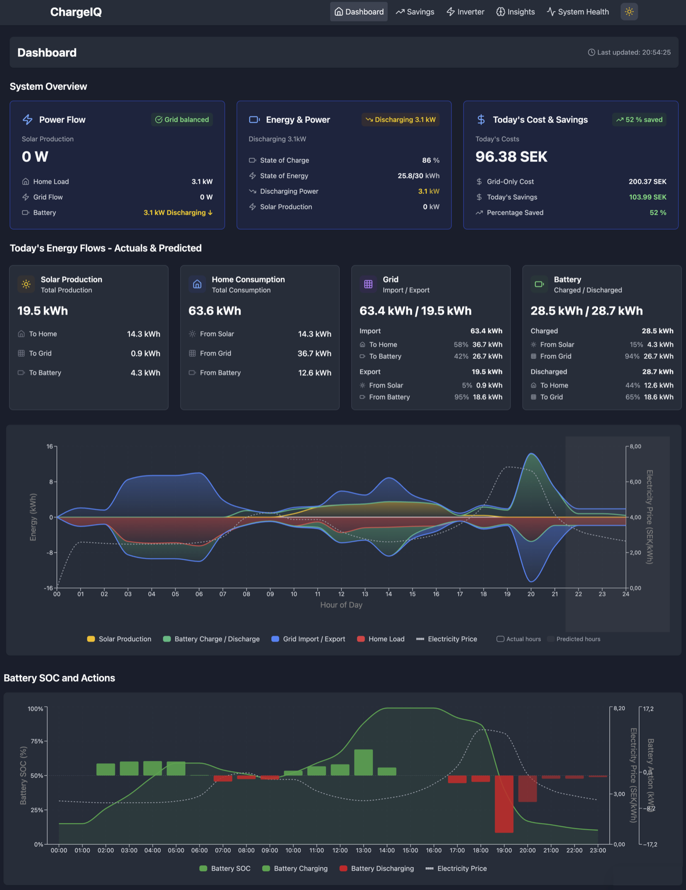
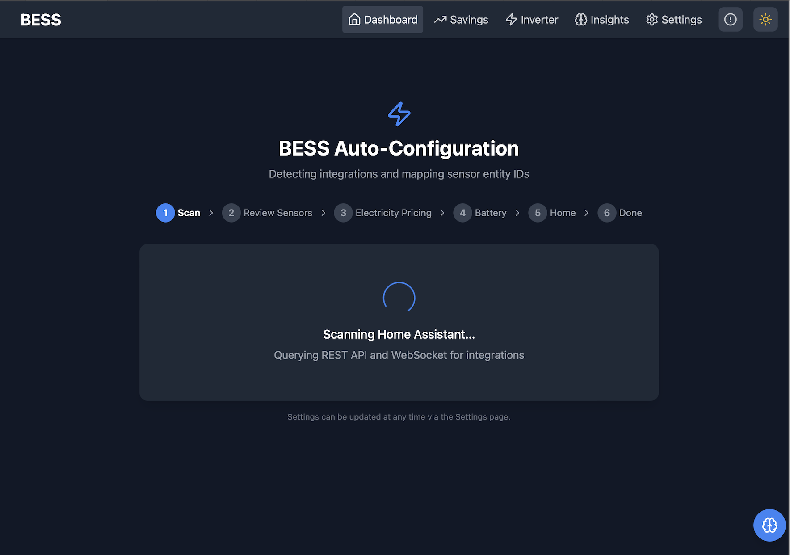
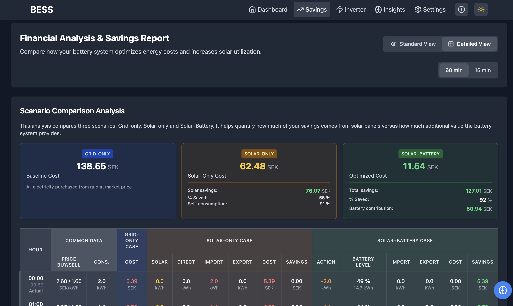
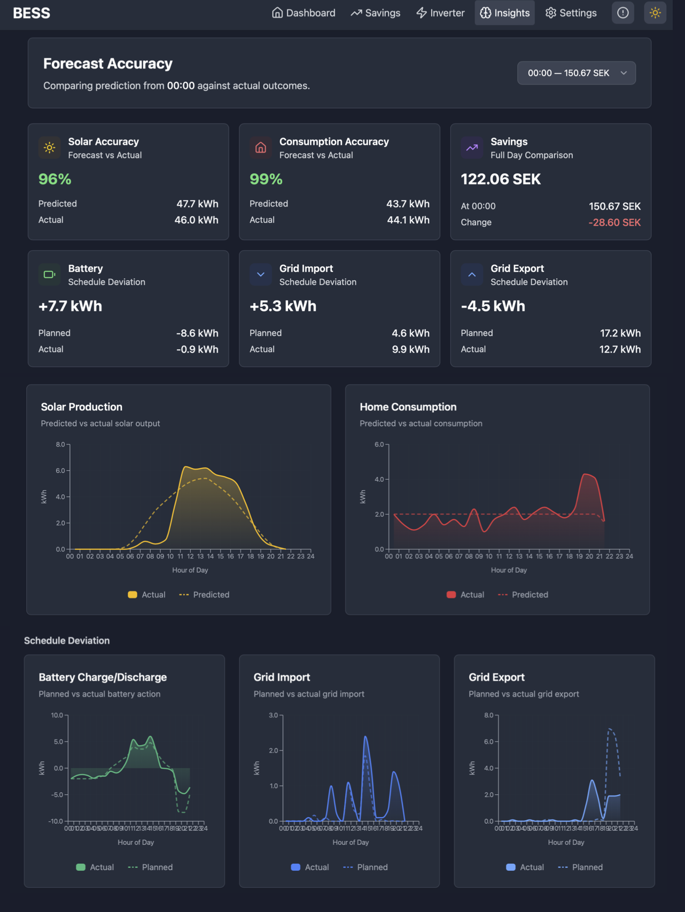
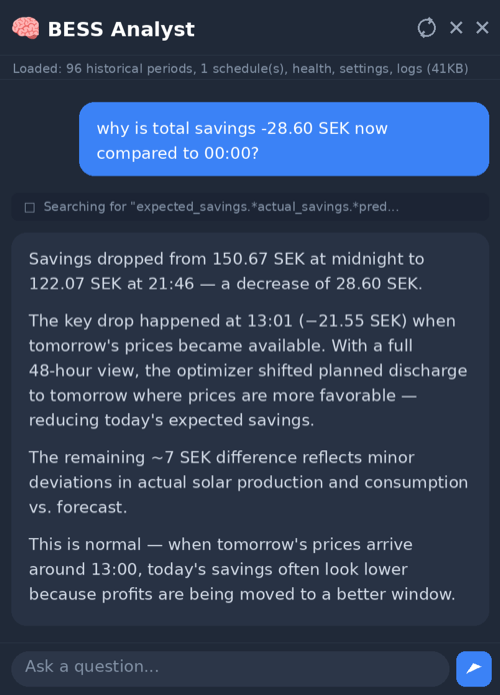

# ChargeIQ — Smart Battery Optimization for Home Assistant

**Install it, forget it, and slash your energy bills.** ChargeIQ continuously optimizes your battery against live electricity prices, solar forecasts, and your household patterns.



---

## 🧪 jvdd Fork

> This is **Jan's personal fork** of [johanzander/bess-manager](https://github.com/johanzander/bess-manager), tuned for an **AC-coupled** setup in the Netherlands:
>
> - **Battery inverter:** Growatt MID 15KTL3-XH (3-phase, ~30 kWh battery)
> - **PV:** separate SolarEdge inverter — no DC solar on the Growatt, so battery only charges via the AC side
> - **Market:** Nord Pool NL (EUR/kWh) via Tibber, salderingsregeling
>
> Each fork release is tagged `10.x-jvdd.N` and published to `ghcr.io/jdungen/bess-manager-{arch}`.

### What this fork adds on top of upstream

Both additions are **opt-in switches, default OFF** — with them off the build behaves exactly like upstream.

| Feature | Why | Upstream status |
|---|---|---|
| **`external_solar_mode`** battery setting | On AC-coupled installs the Growatt has no DC solar input — without this, `SOLAR_STORAGE` periods do nothing. The flag flips `grid_charge=True` *and* the battery mode → `battery_first`, and makes `SOLAR_STORAGE` produce a real TOU/charge period, so the inverter actively pulls from the AC side during the planned solar window. | [PR #167](https://github.com/johanzander/bess-manager/pull/167) — open |
| **`sell_price_equals_buy_price`** price setting | Under net metering (Dutch *saldering*, in force through 2026) every exported kWh offsets an imported one on the bill, so its value is the full buy price — not `spot + export compensation`. Without this the optimizer undervalues exports and skews charge/discharge decisions. | not upstream |

### Previously fork-only, now upstream in 10.0.0

These patches were carried by earlier `9.6.x-jvdd.N` builds and have since landed upstream — the fork no longer duplicates them:

- **Growatt VPP control** — now a first-class upstream feature via **Settings → Inverter → Control Mode = VPP** ([#118](https://github.com/johanzander/bess-manager/issues/118)). The old fork-local `vpp_mode` battery toggle is gone; use upstream's Control Mode instead.
- **SolaxModbus TOU begin/end writes** via the `time.*` entities ([#362](https://github.com/johanzander/bess-manager/issues/362), [#181](https://github.com/johanzander/bess-manager/issues/181)).
- AI Analyst model IDs and Nord Pool continental area hints (merged back in 9.6.3).

### Settings — fork-only toggles

- **Battery → PV coupling → External solar mode** — enable on AC-coupled installs (separate PV inverter, no DC solar on the battery inverter).
- **Pricing → Price Calculation → Sell price equals buy price** — enable while net metering applies. Export Compensation and Export Spot Multiplier are hidden and ignored while it is on.

### Fork installation

Add the fork repository to Home Assistant:

```
https://github.com/jdungen/bess-manager
```

In the add-on store, install **BESS Manager** (it'll show the `10.x-jvdd.N` version). The image is pulled from `ghcr.io/jdungen/bess-manager-{arch}` — make sure that package is public on GHCR.

### Staying in sync with upstream

This fork rebases periodically on upstream `main`. Tags are stable. To check what's in the current fork build vs upstream, see [CHANGELOG.md](CHANGELOG.md) — the `jvdd` releases at the top spell out exactly which patches the fork carries on top of which upstream version.

---

### Setup in Minutes, Not Hours

No YAML files. No manual entering of entity IDs. The setup wizard auto-discovers your inverter, price source, and solar forecast from Home Assistant — just confirm and go.



### See Exactly Where Your Money Goes

ChargeIQ tracks every kWh and every cent. Compare three scenarios side by side — what you'd pay with **grid only**, with **solar only**, and with **solar + optimized battery** — so you can see exactly how much value the battery adds.



### Predictions You Can Trust

See how accurate the forecasts are — solar, consumption, and savings — with predicted-vs-actual comparisons so you know it's working, not guessing.



### Ask Your Battery Why

Something look off? The built-in AI Analyst explains every decision in plain language. Ask "why did the battery charge at 3am?" or "why are today's savings lower than yesterday?" and get a real answer backed by actual system data.



---

## Features

| | |
|---|---|
| **Optimization** | Dynamic programming finds the mathematically optimal schedule — not a simulation, not a heuristic |
| **Resolution** | 15-minute granularity (Nordpool) or 30-minute (Octopus) |
| **Solar aware** | Integrates solar forecast to maximize self-consumption |
| **Battery protection** | Models cycle degradation cost — won't chase marginal gains that wear out your battery |
| **Fuse protection** | Monitors grid current and limits charging to prevent overloading your main fuse |
| **EV aware** | Automatically pauses battery discharge when your EV is charging |
| **Re-optimization** | Continuously updates as prices, solar, and consumption data change |
| **AI Analyst** | Chat with your battery system — ask questions, get explanations |

## Supported Hardware & Markets

### Inverters
- **Growatt MIC/MIN/MOD/MID** — via Growatt Server (cloud) or Modbus (local, TOU or VPP control mode *(VPP experimental)*)
- **Growatt SPH** — via Growatt Server (cloud) or Modbus (local, VPP control mode *(experimental)*)
- **SolaX** — via Solax modbus integration
- **Solis** — via the [solis_modbus](https://github.com/Pho3niX90/solis_modbus) integration (local Modbus) *(experimental)*
- **Huawei LUNA2000** *(experimental)* — via huawei_solar integration (local Modbus)

### Electricity Markets
- **Nordpool** — Nordic spot market (SE, NO, FI, DK, EE, LT, LV)
- **Octopus Energy Agile** — UK market with separate import/export rates
- **ENTSO-e / Belpex** — European day-ahead spot prices via the ENTSO-e Transparency Platform (e.g. Belgian Belpex) *(experimental)*

### Optional Integrations
- **Solcast** or other solar forecast for production predictions
- **InfluxDB** for historical data persistence
- **Tibber** for power monitoring

> **Want support for your inverter?** We're actively looking for testers with GivEnergy, Solis, Huawei, and other systems. [Open an issue](https://github.com/johanzander/bess-manager/issues) or join the discussion! [Sponsoring](https://github.com/johanzander/bess-manager#sponsorship) helps prioritize new hardware support.

## Installation

1. In Home Assistant, go to **Settings → Add-ons → Add-on Store**, click the menu (⋮) → **Repositories**, and add: `https://github.com/johanzander/bess-manager`
2. Find **BESS Battery Manager** in the store, click **Install**, then **Start**
3. Open the web UI and follow the setup wizard

Full instructions: **[Installation Guide](docs/INSTALLATION.md)**

## Documentation

- [Installation Guide](docs/INSTALLATION.md) — Getting started
- [User Guide](docs/USER_GUIDE.md) — Understanding the interface
- [Development Guide](docs/DEVELOPMENT.md) — Contributing

## Community

- **Issues & feature requests**: [GitHub Issues](https://github.com/johanzander/bess-manager/issues)
- **Discussion**: [Home Assistant Community Forum](https://community.home-assistant.io/)

## Sponsorship

ChargeIQ is free and open source. If it's saving you money on your energy bill, consider sponsoring — it directly funds the AI tools used to build new features.

[❤️ Sponsor on GitHub](https://github.com/sponsors/johanzander)

## License

MIT License — see [LICENSE](LICENSE) for details.
